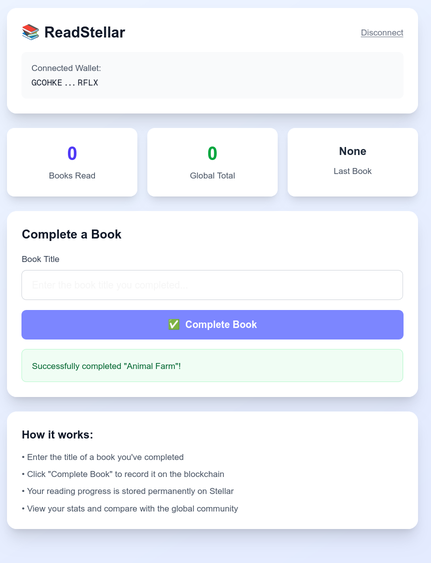

# 📚 ReadStellar - Phase I

A minimal reading tracker dApp built on Stellar Soroban blockchain.

 

## 🎯 Phase I Features

- ✅ **Freighter Wallet Integration**: Connect/disconnect wallet functionality
- ✅ **Simple Reading Tracker**: Record completed books on blockchain
- ✅ **Reading Statistics**: View total books read and last completed book
- ✅ **Global Counter**: See total books read by all users
- ✅ **Modern UI**: Clean, responsive interface with Tailwind CSS

## 🛠 Tech Stack

- **Frontend**: Next.js 14, TypeScript, Tailwind CSS
- **Blockchain**: Stellar Soroban (Rust smart contracts)
- **Wallet**: Freighter Wallet API
- **Network**: Stellar Testnet

## 🚀 Quick Start

### Prerequisites

1. **Install Soroban CLI**:
   ```bash
   curl --proto '=https' --tlsv1.2 -sSf https://sh.rustup.rs | sh
   source ~/.cargo/env
   cargo install --locked soroban-cli
   ```

2. **Install Freighter Wallet**: Download from [freighter.app](https://freighter.app)

3. **Create Testnet Account**: Get testnet XLM from [Stellar Laboratory](https://laboratory.stellar.org/#account-creator?network=testnet)

### Installation

```bash
# Clone and install dependencies
git clone <your-repo>
cd readstellar
npm install
```

### Deployment

1. **Set your secret key**:
   ```bash
   export SECRET_KEY="your_secret_key_here"
   ```

2. **Deploy the contract**:
   ```bash
   ./scripts/deploy.sh
   ```

3. **Start the development server**:
   ```bash
   npm run dev
   ```

4. **Open the app**: http://localhost:3000

## 📖 How to Use

1. **Connect Wallet**: Click "Connect Freighter Wallet" on the landing page
2. **Enter Book Title**: Type the name of a book you've completed
3. **Complete Book**: Click "Complete Book" to record it on the blockchain
4. **View Stats**: See your reading progress and global statistics

## 🏗 Project Structure

```
readstellar/
├── app/
│   ├── page.tsx              # Landing page (wallet connect)
│   └── main/
│       └── page.tsx          # Reading dashboard
├── src/
│   └── lib/
│       ├── wallet.ts         # Freighter wallet integration
│       ├── soroban.ts        # Contract interaction functions
│       └── contract-config.ts # Contract configuration
├── contracts/
│   └── reading_tracker/
│       ├── src/lib.rs        # Soroban smart contract
│       └── Cargo.toml        # Rust dependencies
└── scripts/
    └── deploy.sh             # Contract deployment script
```

## 🔧 Smart Contract Functions

The contract includes 4 simple functions:

1. **`complete_book(reader, book_title)`**: Records a completed book
2. **`get_total_books(reader)`**: Returns reader's total book count
3. **`get_last_book(reader)`**: Returns reader's last completed book
4. **`get_global_count()`**: Returns total books read by all users

## 🧪 Testing

### Manual Testing Checklist

- [ ] Wallet connects successfully
- [ ] Can enter book title
- [ ] "Complete Book" button works
- [ ] Transaction signs in Freighter
- [ ] Counter updates after completion
- [ ] Last book title displays correctly
- [ ] Global counter increments
- [ ] Disconnect wallet works
- [ ] Redirects work properly

### Contract Testing

```bash
# Test complete_book
soroban contract invoke \
  --id YOUR_CONTRACT_ID \
  --source-key $SECRET_KEY \
  --rpc-url https://soroban-testnet.stellar.org \
  --network-passphrase "Test SDF Network ; September 2015" \
  -- complete_book \
  --reader YOUR_ADDRESS \
  --book_title "1984"

# Test get_total_books
soroban contract invoke \
  --id YOUR_CONTRACT_ID \
  --source-key $SECRET_KEY \
  --rpc-url https://soroban-testnet.stellar.org \
  --network-passphrase "Test SDF Network ; September 2015" \
  -- get_total_books \
  --reader YOUR_ADDRESS
```

## 🚨 Troubleshooting

### Common Issues

1. **"Contract ID not set"**: Update `src/lib/contract-config.ts` with your deployed contract ID
2. **Wallet connection fails**: Ensure Freighter is installed and unlocked
3. **Transaction fails**: Check you have enough XLM for fees
4. **Build errors**: Verify Rust and Soroban CLI are installed correctly

### Getting Help

- [Soroban Documentation](https://soroban.stellar.org/docs)
- [Stellar Discord](https://discord.gg/stellar)
- [Freighter Documentation](https://freighter.app/docs)

## 📋 Phase I Completion Criteria

Phase I is complete when:

- [ ] Contract deploys successfully to testnet
- [ ] Wallet connects/disconnects properly
- [ ] Can complete a book (call contract function)
- [ ] Counter increments correctly
- [ ] Last book title displays
- [ ] All operations work end-to-end
- [ ] No critical bugs in testing
- [ ] Running on testnet for 24+ hours without issues

## 🎯 Next Steps (Phase II)

After Phase I completion:

- Book library with 10-20 free books
- Quiz system for reading verification
- Badge system (NFTs) for achievements
- READ token economy
- Database integration
- Enhanced UI/UX

## 📄 License

GNU License - see LICENSE file for details.

---

**Phase I Status**: ✅ Complete  
**Ready for**: Contract deployment and testing  
**Next Phase**: Phase II - Core Reading Features
